# 🤖 AI Agent System Integration Guide

## 🎯 How MongoDB AI Hub Fits Into AI Agent Systems

MongoDB AI Hub serves as the **memory and knowledge management layer** for AI agent systems. Think of it as the agent's brain storage where it keeps prompts, learns from interactions, and maintains context.

## 🧠 System Architecture Diagrams

### 1. Overall AI Agent Ecosystem


### 2. MongoDB AI Hub Internal Architecture

```mermaid
graph LR
    subgraph "🔐 Auth Layer"
        Login[User Login]
        JWT[JWT Tokens]
        Auth[Auth Middleware]
    end
    
    subgraph "🎯 API Layer"
        Routes[API Routes]
        Valid[Validation]
        Rate[Rate Limiting]
    end
    
    subgraph "💾 Data Layer"
        Prompts[(Prompts)]
        Vectors[(Vector Stores)]
        Users[(Users)]
    end
    
    subgraph "🧠 AI Integration"
        Embed[Embeddings]
        Search[Semantic Search]
        Context[Context Building]
    end
    
    Login --> JWT
    JWT --> Auth
    Auth --> Routes
    Routes --> Valid
    Valid --> Rate
    Rate --> Prompts
    Rate --> Vectors
    Rate --> Users
    
    Vectors --> Embed
    Embed --> Search
    Search --> Context
    Context --> Routes
```



### 3. Agent-Hub Interaction Flow


### 4. Multi-Agent Collaboration

```mermaid
graph TB
    subgraph "🎭 Agent Network"
        A1[Coding Agent]
        A2[Research Agent] 
        A3[Writing Agent]
        A4[Analysis Agent]
    end
    
    subgraph "🧠 Shared Memory"
        Hub[MongoDB AI Hub]
        Prompts[(Prompt Library)]
        Knowledge[(Knowledge Base)]
        Context[(Context Store)]
    end
    
    subgraph "🔄 Coordination"
        Router[Agent Router]
        Queue[Task Queue]
        Sync[Synchronization]
    end
    
    A1 <--> Hub
    A2 <--> Hub
    A3 <--> Hub
    A4 <--> Hub
    
    Hub --> Prompts
    Hub --> Knowledge
    Hub --> Context
    
    Router --> A1
    Router --> A2
    Router --> A3
    Router --> A4
    
    Queue --> Router
    Sync --> Queue
```



### 5. Data Flow & Learning Loop


## 🎮 Integration Patterns

### 1. Simple Agent Integration

```javascript
class SimpleAIAgent {
  constructor(hubUrl, authToken) {
    this.hub = new MongoDBHubClient(hubUrl, authToken);
    this.llm = new OpenAI();
  }
  
  async processQuery(userQuery) {
    // 1. Find relevant prompts
    const prompts = await this.hub.searchPrompts(userQuery);
    
    // 2. Get context from vector store
    const context = await this.hub.searchVectors(userQuery);
    
    // 3. Build enhanced prompt
    const enhancedPrompt = this.buildPrompt(prompts, context, userQuery);
    
    // 4. Get LLM response
    const response = await this.llm.complete(enhancedPrompt);
    
    // 5. Store interaction for learning
    await this.hub.storeInteraction(userQuery, response);
    
    return response;
  }
}
```

### 2. Multi-Agent Coordination

```javascript
class AgentCoordinator {
  constructor() {
    this.agents = {
      coding: new CodingAgent(),
      research: new ResearchAgent(),
      writing: new WritingAgent()
    };
    this.hub = new MongoDBHubClient();
  }
  
  async routeQuery(query) {
    // Determine which agent should handle this
    const agentType = await this.classifyQuery(query);
    
    // Get shared context from hub
    const sharedContext = await this.hub.getSharedContext(query);
    
    // Route to appropriate agent
    const result = await this.agents[agentType].process(query, sharedContext);
    
    // Update shared knowledge
    await this.hub.updateSharedKnowledge(query, result);
    
    return result;
  }
}
```

## 🚀 Advanced Use Cases

### 1. Autonomous Learning Agent


### 2. Collaborative Research Agent


## 🔧 Implementation Examples

### 1. Agent Memory Integration

```python
class AgentMemory:
    def __init__(self, hub_client):
        self.hub = hub_client
        
    async def remember(self, context, information):
        """Store information with context"""
        embedding = await self.create_embedding(information)
        await self.hub.store_vector(embedding, {
            'context': context,
            'information': information,
            'timestamp': datetime.now()
        })
        
    async def recall(self, query, limit=5):
        """Retrieve relevant memories"""
        query_embedding = await self.create_embedding(query)
        results = await self.hub.search_similar(query_embedding, limit)
        return [r['metadata']['information'] for r in results]
```

### 2. Prompt Evolution System

```python
class PromptEvolution:
    def __init__(self, hub_client):
        self.hub = hub_client
        
    async def evolve_prompt(self, prompt_id, feedback):
        """Evolve prompt based on feedback"""
        prompt = await self.hub.get_prompt(prompt_id)
        
        if feedback.rating > 0.8:
            # Successful prompt - reinforce
            await self.reinforce_prompt(prompt)
        else:
            # Poor performance - mutate
            new_prompt = await self.mutate_prompt(prompt, feedback)
            await self.hub.create_prompt(new_prompt)
            
    async def mutate_prompt(self, prompt, feedback):
        """Create variations of prompt"""
        mutations = [
            self.add_examples(prompt),
            self.change_tone(prompt),
            self.add_constraints(prompt)
        ]
        
        # Test mutations and return best
        best = await self.test_mutations(mutations, feedback.context)
        return best
```

## 🎯 Future Integration Possibilities

### 1. Swarm Intelligence


### 2. Hierarchical Agent Systems


## 📊 Performance & Scaling

### 1. Hub Performance Architecture


### 2. Scaling Strategy


## 🔮 Next Evolution Steps

1. **Real-time Learning**: Agents learn from every interaction
2. **Cross-Agent Knowledge Sharing**: Agents share discoveries
3. **Emergent Behavior**: Complex behaviors emerge from simple rules
4. **Self-Modification**: Agents modify their own code/prompts
5. **Collective Intelligence**: Swarm-like problem solving

The MongoDB AI Hub is designed to be the foundation for increasingly sophisticated AI agent systems, providing the memory, knowledge management, and coordination capabilities needed for advanced AI applications.