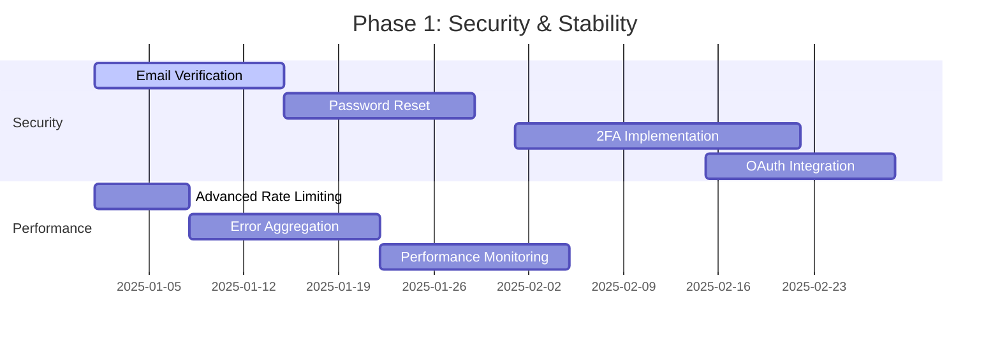
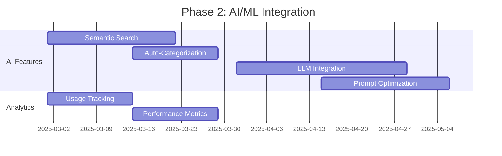
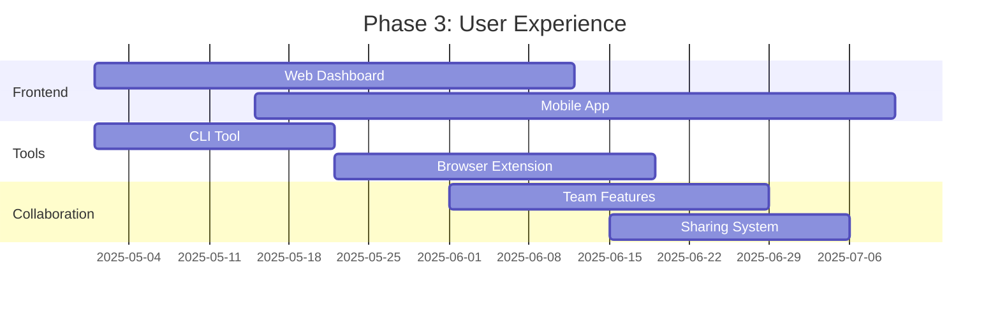
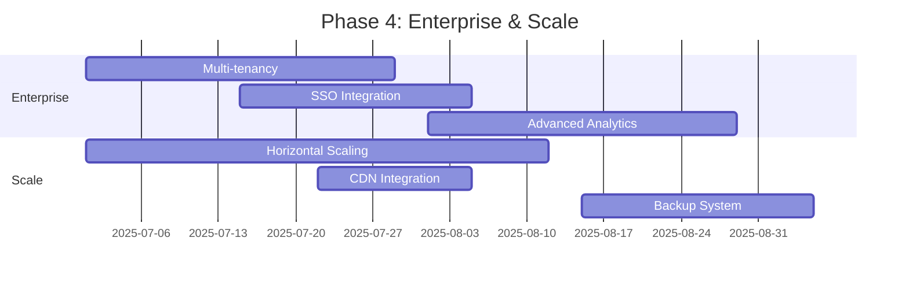
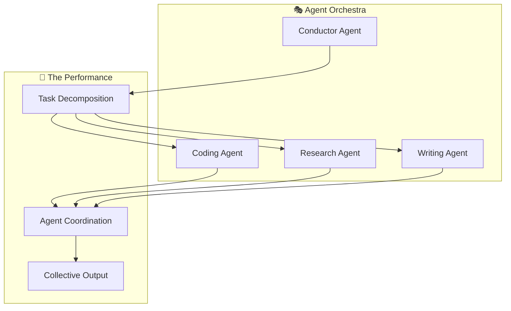

# 🚀 MongoDB AI Hub - Future Roadmap & Missing Features

## 🎯 Current State vs Vision

### ✅ What We Have Now (v1.0)
- **Authentication System**: JWT-based user auth with bcrypt password hashing
- **Prompt Management**: CRUD operations for AI prompts with categorization
- **Vector Store Management**: Basic vector storage and retrieval
- **Auto-Launch**: Cloud environment detection and automatic startup
- **API Documentation**: RESTful API with comprehensive endpoints
- **Kid-Friendly Guide**: Easy-to-understand documentation for young users
- **CI/CD Pipeline**: Automated testing, linting, and deployment

### 🎭 What's Missing (Critical Gaps)

#### 🔐 Security & Authentication
- [ ] **Email Verification**: Users can't verify their email addresses
- [ ] **Password Reset**: No "forgot password" functionality
- [ ] **2FA/MFA**: No two-factor authentication
- [ ] **OAuth Integration**: No Google/GitHub/Discord login
- [ ] **API Key Management**: No API keys for programmatic access
- [ ] **Rate Limiting**: Basic rate limiting exists but needs per-user limits
- [ ] **Session Management**: No session invalidation/logout tracking

#### 🧠 AI/ML Features
- [ ] **Semantic Search**: Basic vector search but no advanced semantic search
- [ ] **Auto-Categorization**: Prompts aren't automatically categorized
- [ ] **Prompt Optimization**: No automatic prompt improvement suggestions
- [ ] **Usage Analytics**: No tracking of prompt effectiveness
- [ ] **Model Integration**: No direct LLM API integration
- [ ] **Embedding Generation**: No automatic text-to-vector conversion
- [ ] **Content Moderation**: No inappropriate content filtering

#### 📊 Data & Analytics
- [ ] **Usage Metrics**: No user activity tracking
- [ ] **Performance Monitoring**: No API response time tracking
- [ ] **Error Logging**: Basic logging but no error aggregation
- [ ] **User Analytics**: No user behavior insights
- [ ] **Prompt Performance**: No success rate tracking
- [ ] **Cost Tracking**: No API usage cost monitoring

#### 🌐 Integration & Ecosystem
- [ ] **Webhook Support**: No event notifications
- [ ] **Plugin System**: No extensibility framework
- [ ] **Third-party Integrations**: No Slack/Discord/Teams bots
- [ ] **Import/Export**: No bulk data operations
- [ ] **Backup/Restore**: No data backup mechanisms
- [ ] **Multi-tenancy**: No organization/team support

#### 🎨 User Experience
- [ ] **Web Dashboard**: No frontend interface (API only)
- [ ] **Mobile App**: No native mobile applications
- [ ] **CLI Tool**: No command-line interface
- [ ] **Browser Extension**: No browser integration
- [ ] **Collaboration**: No sharing/collaboration features
- [ ] **Templates**: No prompt templates or starter packs

## 🗺️ Development Roadmap

### 📅 Phase 1: Security & Stability (Next 2 months)

**Priority Features:**
1. **Email Verification System** 📧
   - Email templates with branded design
   - Verification token management
   - Resend verification functionality
   - Account activation workflow

2. **Password Reset Flow** 🔑
   - Secure token generation
   - Email-based reset links
   - Password strength validation
   - Reset attempt rate limiting

3. **Enhanced Security** 🛡️
   - Two-factor authentication (TOTP)
   - Account lockout after failed attempts
   - IP-based access controls
   - Security audit logging

### 📅 Phase 2: AI/ML Integration (Months 3-4)

**Priority Features:**
1. **Advanced Vector Search** 🔍
   - Hybrid search (keyword + semantic)
   - Multi-modal embeddings (text + code)
   - Similarity threshold tuning
   - Search result ranking

2. **LLM Integration Hub** 🤖
   - OpenAI GPT integration
   - Anthropic Claude integration  
   - Local model support (Ollama)
   - Model switching and comparison

3. **Smart Prompt Features** ✨
   - Auto-completion suggestions
   - Prompt template generation
   - Performance-based recommendations
   - A/B testing for prompts

### 📅 Phase 3: User Experience (Months 5-6)

**Priority Features:**
1. **Web Dashboard** 🌐
   - React-based admin interface
   - Prompt library browser
   - Vector store visualization
   - User management panel

2. **Mobile Applications** 📱
   - React Native cross-platform app
   - Offline prompt access
   - Voice-to-prompt feature
   - Push notifications

3. **Developer Tools** 🛠️
   - CLI for bulk operations
   - Browser extension for web integration
   - VS Code extension
   - API testing interface

### 📅 Phase 4: Enterprise & Scale (Months 7-8)

**Priority Features:**
1. **Enterprise Features** 🏢
   - Organization/team management
   - Role-based access control
   - Single Sign-On (SAML/OIDC)
   - Audit logging and compliance

2. **Scalability Improvements** ⚡
   - Horizontal pod autoscaling
   - Database sharding
   - CDN for static assets
   - Caching optimization

## 🎯 Feature Priority Matrix

### 🔥 Critical (Must Have)
1. **Email Verification** - Security requirement
2. **Password Reset** - Basic user expectation
3. **Web Dashboard** - Essential for user adoption
4. **Semantic Search** - Core AI functionality
5. **Error Monitoring** - Production stability

### ⚡ High Priority (Should Have)
1. **2FA Authentication** - Enhanced security
2. **LLM Integration** - AI hub core value
3. **Mobile App** - User accessibility
4. **CLI Tool** - Developer experience
5. **Usage Analytics** - Product insights

### 💡 Medium Priority (Nice to Have)
1. **OAuth Integration** - User convenience
2. **Browser Extension** - Workflow integration
3. **Collaboration Features** - Team productivity
4. **Auto-categorization** - AI assistance
5. **Webhook Support** - Integration flexibility

### 🎨 Low Priority (Future)
1. **Plugin System** - Extensibility
2. **Multi-tenancy** - Enterprise scaling
3. **Voice Interface** - Advanced UX
4. **Blockchain Integration** - Decentralization
5. **AI Agent Orchestration** - Advanced AI

## 🚧 Technical Debt & Improvements

### 🔧 Code Quality
- [ ] **TypeScript Migration**: Convert from JavaScript to TypeScript
- [ ] **API Versioning**: Implement proper API versioning strategy
- [ ] **Documentation**: Auto-generate API docs from code
- [ ] **Testing**: Increase test coverage to 90%+
- [ ] **Error Handling**: Standardize error responses

### 🏗️ Architecture
- [ ] **Microservices**: Split monolith into focused services
- [ ] **Event-Driven**: Implement event sourcing/CQRS
- [ ] **GraphQL**: Add GraphQL endpoint alongside REST
- [ ] **Real-time**: WebSocket support for live updates
- [ ] **Caching**: Redis/Memcached for performance

### 🛡️ Security
- [ ] **Penetration Testing**: Professional security audit
- [ ] **Dependency Scanning**: Automated vulnerability detection
- [ ] **Input Validation**: Enhanced sanitization
- [ ] **CORS Configuration**: Proper cross-origin setup
- [ ] **Request Signing**: API request signature validation

## 🌟 Moonshot Features (Long-term Vision)

### 🤖 AI Agent Orchestration

### 🧠 Collective Intelligence Network
- **Global Knowledge Graph**: Shared learning across all instances
- **Swarm Learning**: Agents learn collectively from interactions
- **Emergent Behavior**: Complex solutions from simple agent rules
- **Self-Evolving Prompts**: Prompts that improve themselves
- **Cross-Modal Understanding**: Text, image, audio, video integration

### 🌐 Decentralized AI Hub
- **Blockchain Integration**: Decentralized storage and governance
- **Token Economics**: Incentivize contributions and usage
- **Federated Learning**: Privacy-preserving model training
- **Edge Computing**: Local AI processing capabilities
- **Interplanetary File System**: Permanent, distributed storage

## 📊 Success Metrics & KPIs

### 📈 User Engagement
- **Monthly Active Users**: Target 10K+ by end of year
- **Prompt Creation Rate**: 100+ prompts per day
- **Vector Store Usage**: 1M+ vector operations per month
- **API Calls**: 1M+ API requests per month
- **User Retention**: 80% monthly retention rate

### 🚀 Performance
- **API Response Time**: <100ms average
- **Search Latency**: <50ms for vector search
- **Uptime**: 99.9% availability
- **Scalability**: Support 100K concurrent users
- **Cost Efficiency**: <$0.01 per API call

### 🎯 Business
- **Revenue Growth**: Subscription/usage-based model
- **Market Share**: Top 3 in AI prompt management
- **Developer Adoption**: 1K+ GitHub stars
- **Community Growth**: 5K+ Discord members
- **Enterprise Customers**: 100+ organizations

## 🔮 Technology Trends to Watch

### 🤖 AI/ML Trends
- **Multimodal Models**: GPT-4V, DALL-E 3, etc.
- **Local AI**: Llama 2, Mistral, Phi-2 running locally
- **AI Agents**: AutoGPT, LangChain agents
- **Vector Databases**: Specialized vector search engines
- **Retrieval Augmented Generation**: RAG improvements

### 🏗️ Infrastructure Trends
- **Serverless AI**: Edge computing for AI
- **WebAssembly**: WASM for AI in browsers
- **Kubernetes AI**: K8s operators for ML workloads
- **Edge AI**: Running AI on mobile/IoT devices
- **Quantum Computing**: Early quantum AI algorithms

## 🎬 Conclusion

MongoDB AI Hub is positioned to become the foundational memory and knowledge management layer for the next generation of AI agent systems. The roadmap balances immediate user needs (security, UX) with long-term vision (AI orchestration, collective intelligence).

**Next Steps:**
1. **Community Feedback**: Gather user input on priority features
2. **MVP Development**: Focus on Phase 1 critical features
3. **Partnership Strategy**: Integrate with existing AI platforms
4. **Funding Strategy**: Support development of advanced features
5. **Open Source Strategy**: Build community around the platform

The future is bright for AI-powered knowledge management! 🌟