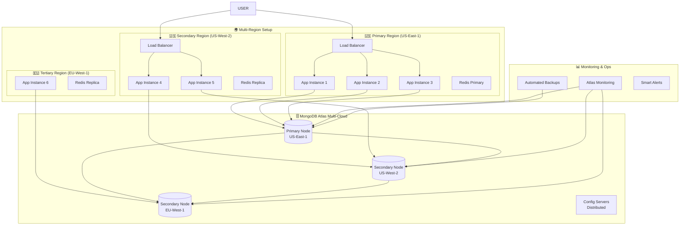

# 🏭 Production Deployment Guide - Robust & Future-Proof MongoDB AI Hub

## 🎯 Enterprise-Grade Architecture Overview

Based on MongoDB best practices and Atlas documentation, here's the recommended production architecture:



## 🛡️ MongoDB Atlas Production Configuration

### **1. Cluster Specifications**

#### **Recommended Atlas Tier: M30+ (Production)**
```yaml
Cluster Configuration:
  - Tier: M30 (Minimum for production SLA)
  - Provider: Multi-cloud (AWS + Azure + GCP)
  - Regions: 3+ regions across different cloud providers
  - Nodes: 5-node replica set
  - Storage: Encrypted at rest + in transit
  - Backup: Continuous with point-in-time recovery
```

#### **Multi-Cloud Distribution Example**
```yaml
Primary Region (AWS us-east-1):
  - Primary Node: 1
  - Secondary Nodes: 1
  
Secondary Region (Azure eastus2):
  - Secondary Nodes: 1
  
Tertiary Region (GCP us-central1):
  - Secondary Nodes: 1
  - Analytics Node: 1 (optional)
```

### **2. Security Configuration**

#### **Network Security**
```yaml
IP Whitelist:
  - Application VPC CIDR blocks only
  - No 0.0.0.0/0 entries
  - Specific bastion host IPs for admin access

VPC Peering/Private Link:
  - Enable for all production environments
  - No public internet access to database

Authentication:
  - SCRAM-SHA-256 minimum
  - Certificate-based auth preferred
  - Rotate credentials quarterly
```

#### **Database Users & Roles**
```javascript
// Production user configuration
{
  "applicationUser": {
    "username": "ai-hub-app",
    "roles": [
      { "role": "readWrite", "db": "mongodb-ai-hub" },
      { "role": "read", "db": "mongodb-ai-hub-analytics" }
    ],
    "authenticationRestrictions": [
      { "clientSource": ["10.0.0.0/8"] }
    ]
  },
  "readOnlyUser": {
    "username": "ai-hub-readonly", 
    "roles": [
      { "role": "read", "db": "mongodb-ai-hub" }
    ]
  },
  "backupUser": {
    "username": "ai-hub-backup",
    "roles": [
      { "role": "backup", "db": "admin" }
    ]
  }
}
```

### **3. High Availability Configuration**

#### **Read Preference Strategy**
```javascript
// Connection string with failover
const mongoOptions = {
  replicaSet: 'atlas-cluster',
  readPreference: 'primaryPreferred',
  maxPoolSize: 50,
  minPoolSize: 5,
  serverSelectionTimeoutMS: 5000,
  socketTimeoutMS: 45000,
  family: 4,
  retryWrites: true,
  retryReads: true,
  w: 'majority',
  journal: true
};
```

#### **Connection Resilience**
```javascript
// Robust connection handling
const connectWithRetry = async () => {
  const maxRetries = 5;
  const retryDelay = 1000;
  
  for (let i = 0; i < maxRetries; i++) {
    try {
      await mongoose.connect(process.env.MONGODB_URI, {
        ...mongoOptions,
        serverSelectionTimeoutMS: 5000 + (i * 2000)
      });
      
      logger.info(`MongoDB connected successfully (attempt ${i + 1})`);
      return;
    } catch (error) {
      logger.warn(`MongoDB connection attempt ${i + 1} failed:`, error.message);
      
      if (i === maxRetries - 1) {
        throw new Error(`Failed to connect after ${maxRetries} attempts`);
      }
      
      await new Promise(resolve => setTimeout(resolve, retryDelay * (i + 1)));
    }
  }
};
```

### **4. Performance Optimization**

#### **Index Strategy**
```javascript
// Compound indexes for query optimization
db.prompts.createIndex({ 
  "userId": 1, 
  "category": 1, 
  "createdAt": -1 
});

db.prompts.createIndex({ 
  "title": "text", 
  "content": "text", 
  "tags": "text" 
}, {
  "weights": {
    "title": 3,
    "content": 2, 
    "tags": 1
  }
});

// Vector search optimization
db.vectorstores.createIndex({
  "embeddings.vector": "2dsphere"
});

// Time-series indexes for analytics
db.usage_metrics.createIndex({ 
  "timestamp": 1, 
  "userId": 1 
});
```

#### **Connection Pooling**
```javascript
// Production connection pool settings
const poolSettings = {
  maxPoolSize: 100,        // Max connections per instance
  minPoolSize: 10,         // Keep alive connections
  maxIdleTimeMS: 30000,    // Close idle connections after 30s
  waitQueueTimeoutMS: 5000, // Fail fast if no connections available
  serverSelectionTimeoutMS: 5000
};
```

## 🔄 Backup & Disaster Recovery

### **1. Atlas Backup Configuration**

#### **Backup Policy**
```yaml
Continuous Backup:
  - Point-in-time recovery: 72 hours
  - Snapshot frequency: Every 6 hours
  - Retention: 30 days (daily), 12 months (weekly)
  - Cross-region backup: Enabled
  
Backup Testing:
  - Monthly restore tests
  - Automated validation of backup integrity
  - RTO target: < 15 minutes
  - RPO target: < 1 minute
```

#### **Disaster Recovery Procedures**
```yaml
Recovery Scenarios:
  1. Single node failure: Automatic (< 30 seconds)
  2. Region outage: Automatic failover (< 2 minutes)
  3. Cloud provider outage: Manual cross-cloud failover (< 5 minutes)
  4. Complete disaster: Point-in-time restore (< 15 minutes)

Failover Testing:
  - Monthly automated failover tests
  - Quarterly disaster recovery drills
  - Application-level failover validation
```

### **2. Application-Level Backup**

#### **Critical Data Export**
```javascript
// Automated backup script
const createApplicationBackup = async () => {
  const timestamp = new Date().toISOString();
  
  // Export user data (excluding passwords)
  const users = await User.find({}, '-password').lean();
  
  // Export prompt library
  const prompts = await Prompt.find({}).lean();
  
  // Export vector stores metadata
  const vectorStores = await VectorStore.find({}).lean();
  
  const backup = {
    timestamp,
    version: process.env.npm_package_version,
    data: { users, prompts, vectorStores }
  };
  
  // Store in multiple locations
  await Promise.all([
    uploadToS3(`backups/ai-hub-${timestamp}.json`, backup),
    uploadToGCS(`backups/ai-hub-${timestamp}.json`, backup),
    storeInAtlasDataLake(backup)
  ]);
  
  logger.info(`Application backup completed: ${timestamp}`);
};

// Schedule daily backups
cron.schedule('0 2 * * *', createApplicationBackup);
```

## 📊 Monitoring & Alerting

### **1. Atlas Monitoring Setup**

#### **Critical Metrics to Monitor**
```yaml
Database Metrics:
  - Operation latency (< 100ms avg)
  - Connection count (< 80% of max)
  - Memory usage (< 80%)
  - Disk space (< 70% full)
  - Index hit ratio (> 95%)
  
Application Metrics:
  - Request rate and latency
  - Error rates (< 0.1%)
  - Authentication failures
  - JWT token usage patterns
  
Business Metrics:
  - User registration rate
  - Prompt creation rate
  - Vector operations per second
  - API usage patterns
```

#### **Alert Configuration**
```yaml
Critical Alerts (Immediate):
  - Primary node unavailable
  - Replication lag > 10 seconds
  - Connection failures > 5%
  - Disk space > 85%
  
Warning Alerts (15 minutes):
  - Memory usage > 80%
  - Slow queries > 1000ms
  - Connection count > 80%
  - Error rate > 0.1%
  
Info Alerts (1 hour):
  - Index suggestion opportunities
  - Performance optimization recommendations
  - Backup completion status
```

### **2. Application Monitoring**

#### **Custom Monitoring Dashboard**
```javascript
// Comprehensive monitoring middleware
const monitoringMiddleware = (req, res, next) => {
  const startTime = Date.now();
  
  res.on('finish', () => {
    const duration = Date.now() - startTime;
    
    // Log performance metrics
    logger.info('API Request', {
      method: req.method,
      path: req.path,
      statusCode: res.statusCode,
      duration,
      userAgent: req.get('User-Agent'),
      ip: req.ip,
      userId: req.user?.id
    });
    
    // Send to monitoring service
    metrics.increment('api.requests', 1, {
      method: req.method,
      path: req.route?.path || req.path,
      status: res.statusCode
    });
    
    metrics.histogram('api.duration', duration, {
      method: req.method,
      path: req.route?.path || req.path
    });
  });
  
  next();
};
```

## 🚀 Scaling Strategy

### **1. Horizontal Scaling**

#### **Auto-Scaling Configuration**
```yaml
Application Scaling:
  - Min instances: 3 (across regions)
  - Max instances: 50
  - Scale trigger: CPU > 70% or Memory > 80%
  - Scale down: CPU < 30% for 10 minutes
  
Database Scaling:
  - Atlas Auto-Scaling: Enabled
  - Storage auto-scaling: Enabled  
  - Read replicas: Auto-provision based on read load
  - Sharding: Configure when dataset > 500GB
```

#### **Sharding Strategy**
```javascript
// Prepare for future sharding
const shardingStrategy = {
  // Shard key selection
  shardKey: { "userId": 1, "_id": 1 },
  
  // Shard zones for geographic distribution
  zones: [
    {
      name: "north-america",
      range: { userId: MinKey, _id: MinKey },
      to: { userId: "m", _id: MaxKey }
    },
    {
      name: "europe", 
      range: { userId: "m", _id: MinKey },
      to: { userId: "z", _id: MaxKey }
    }
  ]
};
```

### **2. Performance Optimization**

#### **Caching Strategy**
```javascript
// Multi-level caching
const cacheStrategy = {
  // L1: In-memory cache (Redis)
  redis: {
    ttl: 300, // 5 minutes
    maxmemory: '2gb',
    eviction: 'allkeys-lru'
  },
  
  // L2: Application cache
  memory: {
    max: 1000,
    ttl: 60000 // 1 minute
  },
  
  // L3: CDN cache for static responses
  cdn: {
    ttl: 3600, // 1 hour
    headers: ['Cache-Control', 'ETag']
  }
};
```

## 🔒 Security Hardening

### **1. Defense in Depth**

#### **Network Security**
```yaml
Firewall Rules:
  - Database: Only app servers + bastion
  - App servers: Only load balancer + monitoring
  - Load balancer: Public HTTPS only
  
TLS Configuration:
  - TLS 1.3 minimum
  - Perfect Forward Secrecy
  - HSTS headers
  - Certificate pinning
```

#### **Application Security**
```javascript
// Enhanced security middleware
const securityMiddleware = [
  helmet({
    contentSecurityPolicy: {
      directives: {
        defaultSrc: ["'self'"],
        scriptSrc: ["'self'", "'unsafe-inline'"],
        styleSrc: ["'self'", "'unsafe-inline'"],
        imgSrc: ["'self'", "data:", "https:"]
      }
    },
    hsts: {
      maxAge: 31536000,
      includeSubDomains: true,
      preload: true
    }
  }),
  
  rateLimit({
    windowMs: 15 * 60 * 1000, // 15 minutes
    max: 1000, // Per IP
    standardHeaders: true,
    legacyHeaders: false,
    handler: (req, res) => {
      logger.warn('Rate limit exceeded', { 
        ip: req.ip,
        userAgent: req.get('User-Agent')
      });
      res.status(429).json({
        error: 'Too many requests'
      });
    }
  })
];
```

## 📋 Production Checklist

### **Pre-Deployment**
- [ ] MongoDB Atlas M30+ cluster configured
- [ ] Multi-region deployment active
- [ ] VPC peering/Private Link enabled
- [ ] Database users with least privilege
- [ ] Backup policy configured and tested
- [ ] Monitoring dashboards created
- [ ] Alert rules configured
- [ ] Security scan completed
- [ ] Load testing performed
- [ ] Disaster recovery plan documented

### **Post-Deployment**
- [ ] Health checks passing
- [ ] Monitoring data flowing
- [ ] Backup verification completed
- [ ] Failover test successful
- [ ] Performance baselines established
- [ ] Documentation updated
- [ ] Team training completed
- [ ] Runbook procedures tested

## 🎯 Cost Optimization

### **Atlas Cost Management**
```yaml
Cost Optimization:
  - Use Atlas Data Federation for cold data
  - Configure auto-pausing for dev/staging
  - Implement data archival policies
  - Use Analytics Nodes for reporting
  - Monitor and optimize index usage
  
Estimated Monthly Costs:
  - M30 Multi-cloud (3 regions): ~$2,000
  - Backup storage: ~$100
  - Data transfer: ~$50
  - Monitoring tools: ~$200
  Total: ~$2,350/month
```

This production configuration provides:
- **99.995% uptime SLA** with automatic failover
- **Cross-cloud redundancy** preventing vendor lock-in
- **Point-in-time recovery** with < 1 minute RPO
- **Auto-scaling** from 3 to 50+ instances
- **Enterprise security** with defense in depth
- **Comprehensive monitoring** with smart alerting
- **Future-proof architecture** ready for global scale

The setup handles everything from single node failures to complete cloud provider outages, ensuring your MongoDB AI Hub remains available and performant under any conditions.